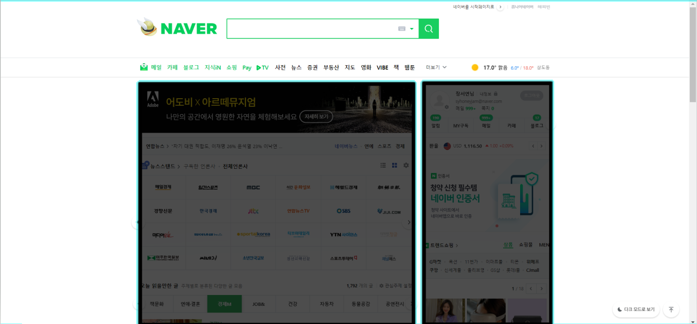
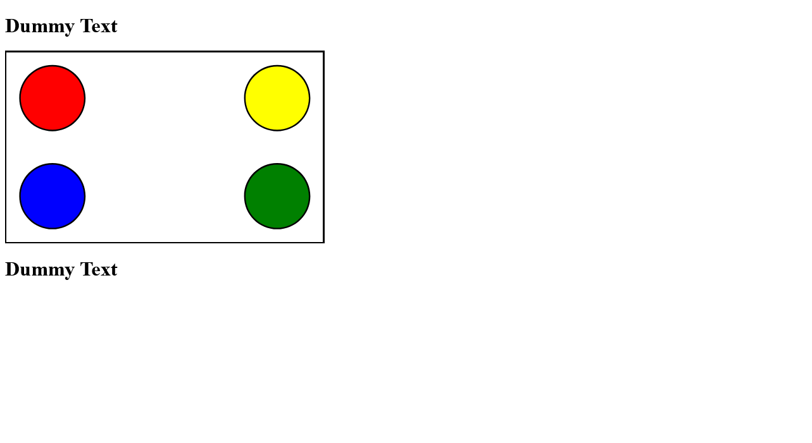
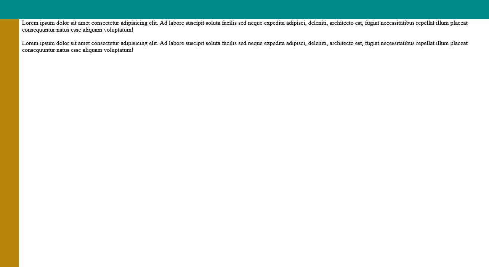

박스를 이루고 있는 것은
- 컨텐츠
- 패딩
- 보더
- 마진

## 수평정렬과 중앙정렬

네이버 메인페이지도 수평 정렬되어있는 것을 알 수 있다

## One True 레이아웃

One True 레이아웃의 핵심은, 우선 행을 구성한 다음, 각 행 안의 열을 구성한다는 점이다. 
width와 height을 주어 각 행 안의 생성한 열로 이루어진 박스들이 영역을 다 차지하도록 하자.

## 요소 배치
요소를 배치하는데는 절대위치와 상대위치가 있다. 애플 페이지의 경우 절대위치를 사용하는 대표적인 페이지이다.

- 절대위치를 사용해 요소 배치하기

> 자손의 position 속성에 absolute 키워드를 적용하려면?

1. 부모에 height 속성을 입력해야 한다.
2. 부모의 position 속성에 relative를 적용한 뒤 자손의 position 속성에 absolute 적용

## 요소를 중앙에 배치
1. 중앙정렬하려는 div 태그의 position 속성을 absolute로 지정
2. left속성과 top 속성을 50%로 지정
3. margin-left속성과 margin-top 속성에 각각의 값의 절반인 음수 입력

## 고정 바 배치

1. position 스타일 속성에 fixed 를 적용
2. left, top, right, bottom 속성에 위치값을 입력해 위치를 설정
3. width 속성과 height 속성으로 크기를 설정