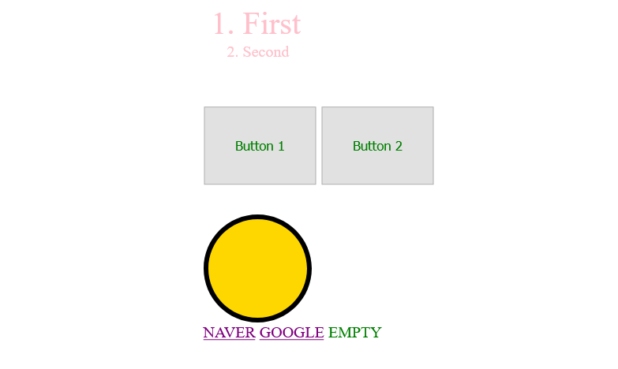

Cascading Style Sheet
Cascading이란, 폭포처럼 쏟아지는 형태를 말한다. 

웹 브라우저는 화면을 표시할 때, .css 파일에서 개발자가 정의한 author style이 있으면 그것을 먼저 적용하고, 없다면 Browser의 스타일을 적용한다. 예를 들어, 버튼을 하나 만들었을 때 개발자가 따로 .css파일을 만들어 버튼을 꾸몄다면 그 스타일을 브라우저가 적용하여 화면에 뿌려주고, 만약 없다면, 유저가 정의한 것(예를 들어 다크모드)를 뿌려주고, 그것도 없다면 브라우저가 지정한 기본 버튼 스타일을 브라우저가 화면에 뿌려준다.

이러한 모습은 없으면 아래로 떨어지는 폭포의 형태와도 같다.

이러한 cascading 의 연결고리를 끊어주는 녀석이 있는데, 바로 `!important`라는 녀석이다. 이 키워드를 쓰면 연결고리를 무시하고 '내가 제일 중요한 스타일이야'라고 강제적으로 말해주는 것과 같다. 그러나 현업에서 코드리뷰를 할 때 이 키워드를 쓰면 bad smell이 난다고 하는데, 이유는 css 구조가 뭔가 잘못되었거나 html 단계에서 박스 구조를 잘못 나눴다든가 등의 나쁜 아키텍쳐를 쓰는 경우 !important를 쓰게 된다.

최대한 이 키워드는 지양 하는 것이 좋다.

html에서, 커다란 body라는 상자 안에 컨텐츠를 마구 넣는 것이 아니라, body안에서도 커다란 섹션들로 나누고, 그 커다란 섹션 하나 안에도 작은 단위의 박스들로 나누어서 정리해야 한다. 이렇게 하는 이유는 레이블링을 쉽게 하기 위해서이다.

레이블링이 잘 되어있으면 css로 꾸밀때 선택을 잘 하게 될 수 있기때문이다.

## Selector 란?
HTML의 어떤 태그를 고를 것인지를 규정하는 것이다. *모양은 모든 태그들을 선택하는 것이고, .은 클래스를 선택한다. div 를 써서 div태그들을 모두 선택할 수 있다.

- universal `*`
- type `tag`
- id `#`
- class `.`
- state `:`
- attribute `[]`

중앙정렬하는법 :(1) width 정하고, (2) margin: 0 auto;

